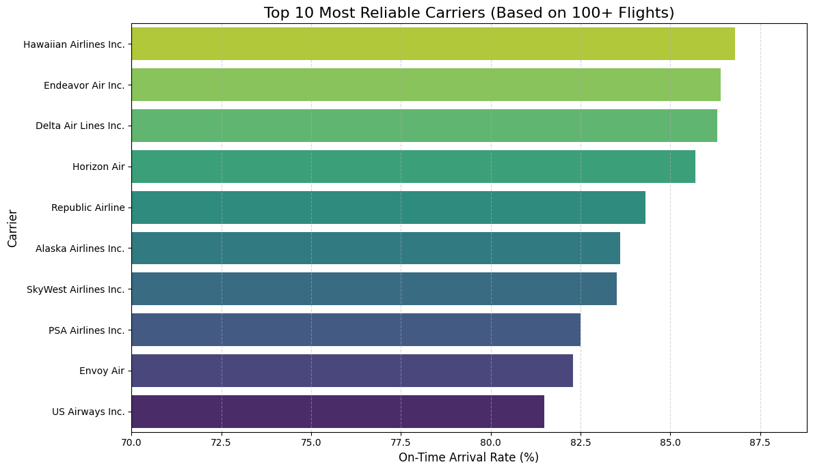

# Airline Performance & Delay Analysis for Strategic Business Decisions


## 1. Executive Summary

This analysis provides a comprehensive review of U.S. airline on-time performance and the root causes of delays. By examining carrier reliability, delay attribution, seasonal trends, and airport infrastructure, we have uncovered critical insights to drive strategic decisions in operations, marketing, and partner management.

*   **The Problem:** The airline industry faces significant revenue loss and customer dissatisfaction due to flight delays. To mitigate this, the business needs to understand which carriers are most reliable, what truly causes delays, when we are most vulnerable, and where systemic bottlenecks exist.

*   **Key Findings:**
    *   **Top Performers Identified:** **Hawaiian Airlines Inc.** is the most reliable carrier with an **86.8% on-time arrival rate**. This is significantly above the industry median of 81.5%.
    *   **Internal Inefficiencies are the Primary Issue:** Contrary to common belief, internal factors (**Carrier and Late Aircraft Delays**) account for **73% of all delay minutes**. Weather is a minor factor, contributing only **5.4%**.
    *   **Seasonal Risk is Predictable:** The summer months of **June and July** are the worst-performing, with delay rates reaching over **22%**. In contrast, the fall season (**September-November**) is the most reliable, with delay rates under 15%.
    *   **Major Airports are Key Bottlenecks:** **Newark (EWR)** is the most inefficient airport in the National Airspace System, imposing an average of **8.86 minutes of NAS-related delay on every single flight**, regardless of the carrier.

*   **Business Impact:** These findings empower the company to renegotiate carrier contracts based on objective performance data, launch an internal efficiency audit to reclaim millions of lost minutes, de-risk marketing campaigns by targeting low-risk periods, and optimize flight routes to avoid costly infrastructure bottlenecks.

---

## 2. Key Business Questions & Analysis

### I. Carrier Reliability Audit

*   **Business Question:** "We are renegotiating contracts with corporate partners. I need a ranking of carriers based on their on-time arrival rate to identify the most reliable partners."

*   **Key Insight:** **Hawaiian Airlines Inc.** stands out as the industry leader in reliability with an **86.8% on-time arrival rate**. The top three carriers—Hawaiian, Endeavor Air, and Delta—all maintain on-time rates above 85%, offering a clear benchmark for performance.

*   **Supporting Visual:**

    

    *Caption: This bar chart ranks the top 10 carriers (with over 100 flights) by their on-time arrival percentage. The clear visual hierarchy distinguishes top-tier performers from the rest of the pack.*

*   **Actionable Recommendation:**
    *   Prioritize and strengthen partnerships with top-performing carriers like **Hawaiian Airlines, Endeavor Air, and Delta Air Lines**.
    *   Use the 85%+ on-time rate as a data-driven performance benchmark when negotiating contracts with all airline partners, potentially securing better terms or service level agreements (SLAs) with lower-ranked carriers.

---

### II. Delay Cost Attribution

*   **Business Question:** "Management is blaming the weather for recent losses, but Operations suspects internal inefficiencies are the real problem. What is the true source of our delays?"

*   **Key Insight:** Internal, controllable factors are the overwhelming cause of delays. **Late-arriving aircraft (38.5%)** and **carrier-specific issues (34.5%)** together account for **73% of all delay minutes**. In contrast, external factors like **weather (5.4%)** and **security (0.2%)** have a minimal impact on total lost time.

*   **Supporting Visual:**

    

    *Caption: This chart breaks down the total minutes of delay by their root cause. It powerfully illustrates that 'Late Aircraft' and 'Carrier' delays are the primary drivers of lost time, not external factors like weather.*

*   **Actionable Recommendation:**
    *   Immediately redirect resources away from weather mitigation and launch a focused internal operational review.
    *   Investigate the root causes of "Late Aircraft Delay" (e.g., turnaround times, network scheduling) and "Carrier Delay" (e.g., crew availability, maintenance, gate operations) to address the **73% of delays that are within our direct control**.

---

### III. Seasonal Risk Assessment

*   **Business Question:** "Marketing wants to launch a 'Guaranteed On-Time' campaign. Which months have the highest risk of failure, and which are the safest bets?"

*   **Key Insight:** Flight reliability follows a clear seasonal pattern. The highest risk of delays occurs during the summer, peaking in **June** where **22.3% of all flights are delayed**. The safest period for a campaign is the fall, with **September** being the best-performing month with only a **13.7% delay rate**.

*   **Supporting Visual:**

    

    *Caption: This line graph visualizes the on-time arrival rate for each month. The significant dip in the summer (June/July) and the peak in the fall (September) are clearly visible, indicating predictable periods of high and low operational risk.*

*   **Actionable Recommendation:**
    *   **High-Risk - Avoid:** Do not launch the "Guaranteed On-Time" campaign during the high-risk months of **June, July, and December**.
    *   **Low-Risk - Target:** Schedule the campaign launch for **September, October, or November** to maximize the probability of success, improve brand reputation, and minimize financial liability from guarantee payouts.

---

### IV. Infrastructure Bottleneck Identification

*   **Business Question:** "We suspect that certain airports are structurally inefficient regardless of the airline. Identify the top airports that suffer from 'National Airspace System' (NAS) delays."

*   **Key Insight:** **Newark Liberty International (EWR)** is the most significant infrastructure bottleneck in the nation, adding an average of **8.86 minutes of NAS delay to every flight**. This is **34% worse** than the next most congested airport, LaGuardia (LGA), at 6.68 minutes per flight.

*   **Supporting Visual:**

    

    *Caption: This chart ranks the top 10 airports by their average NAS delay minutes per flight. It highlights that the New York-area airports (EWR, LGA, JFK) and San Francisco (SFO) are major systemic chokepoints.*

*   **Actionable Recommendation:**
    *   Conduct a network analysis to explore rerouting key connecting flights away from **EWR, LGA, and SFO** where feasible to improve system-wide on-time performance.
    *   Engage with airport authorities and the FAA, using this data to advocate for resource allocation and infrastructure improvements at the most critical bottleneck airports.

---

## 3. Data & Methodology

*   **Data Source:** The analysis was performed on the "Airline On-Time Performance and Causes of Flight Delays" dataset, containing over 149,000 records of flight operations aggregated monthly by carrier and airport.

---

## 4. Limitations & Future Work

*   **Limitations:**
    *   **Granularity:** The data is aggregated monthly, preventing analysis of specific events on particular days (e.g., major snowstorms).
    *   **Root Cause Ambiguity:** The categories "Carrier Delay" and "Late Aircraft Delay" are broad. Further investigation would be needed to pinpoint the precise operational failures they represent.
    *   **Financial Impact:** This analysis focuses on time-based metrics. It does not include data on the direct financial cost of delays (e.g., fuel, crew overtime, passenger compensation).

*   **Future Work:**
    *   **Predictive Modeling:** Develop a machine learning model to predict the likelihood of a flight being delayed based on carrier, airport, month, and time of day.
    *   **Cost Analysis:** Integrate financial data to quantify the dollar cost of each minute of delay by cause, creating a clear ROI for operational improvements.
    *   **Passenger Impact Analysis:** Correlate delay data with passenger volume and connection data to identify the flights where delays cause the most significant disruption to travelers.

---

## 5. Technical Appendix

*   **Tools & Libraries:**
    *   Python 3.9
    *   Pandas: For data manipulation and aggregation.
    *   NumPy: For numerical operations.
    *   Matplotlib & Seaborn: For data visualization.
    *   Jupyter Notebook: For interactive analysis and reporting.

*   **Data Cleaning & Preparation:**
    The raw dataset contained inconsistent data types in numerical columns, with month abbreviations ('yan', 'fev', etc.) mixed with numbers. A cleaning script was implemented to:
    1.  Create a mapping of month abbreviations to their corresponding numeric values.
    2.  Iterate through all affected columns, replacing the text abbreviations.
    3.  Convert the cleaned columns to a proper numeric `float64` data type, coercing any errors to `NaN` for inspection.
    4.  The cleaning process successfully converted all relevant columns, creating 208 `NaN` rows which were handled appropriately in the aggregated analyses.

*   **Setup & Installation:**
    1.  Clone the repository:
        ```bash
        git clone https://github.com/SelimNajaf/Airline-Performance-Analysis.git
        cd airline-delay-analysis
        ```
    2.  Install the required libraries:
        ```bash
        pip install pandas numpy matplotlib seaborn
        ```
    3.  Launch Jupyter Notebook and open `Airline_Delay_Analysis.ipynb`.
---

## 📬 Contact
**Selim Najaf**

*   **LinkedIn:** [linkedin.com/in/selimnajaf-data-analyst](https://www.linkedin.com/in/selimnajaf-data-analyst/)
*   **GitHub:** [github.com/SelimNajaf](https://github.com/SelimNajaf)
